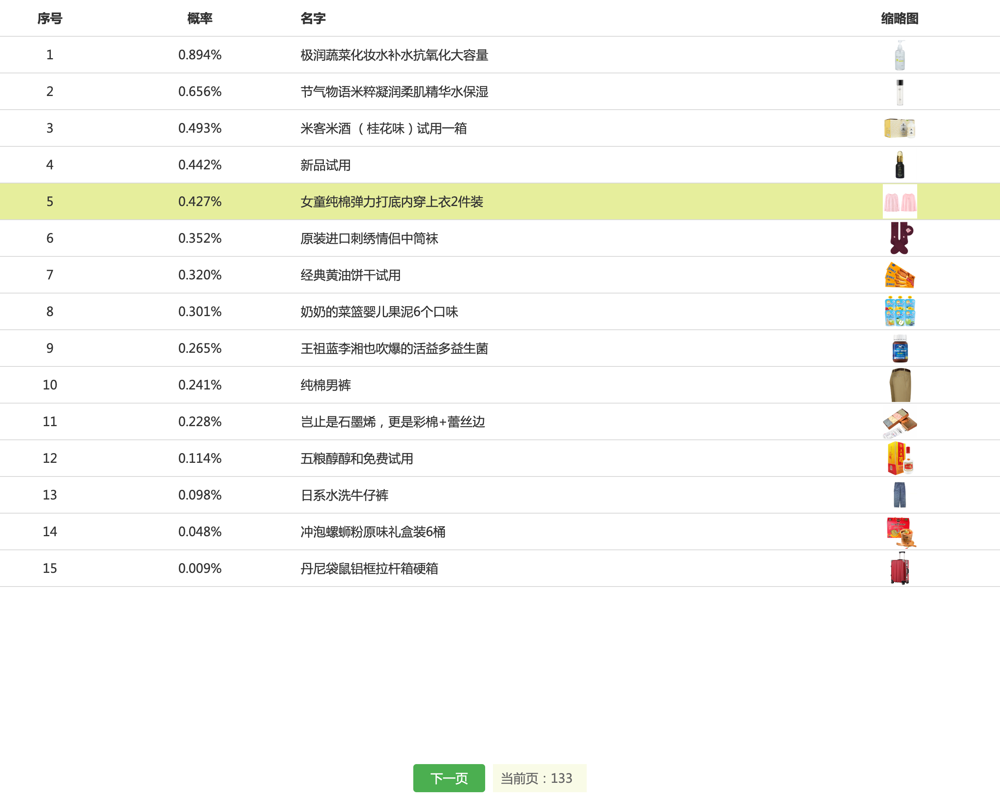
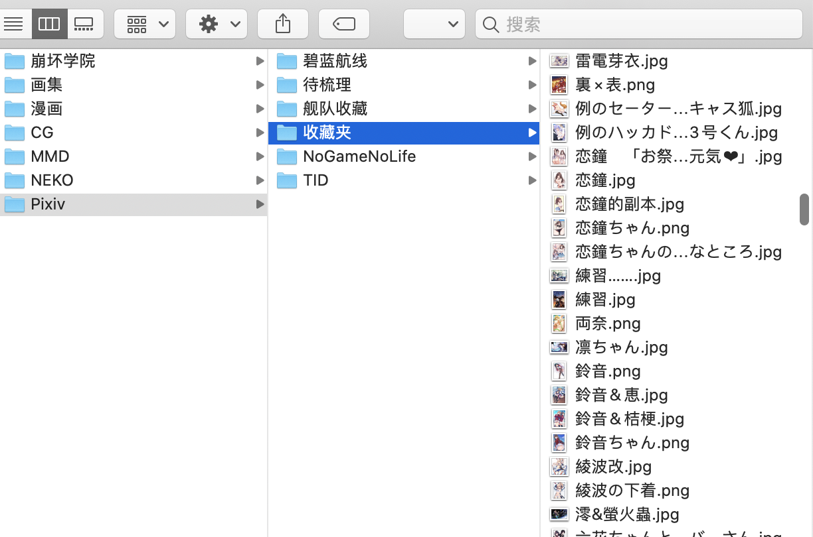

# Spider

日常脚本/爬虫.

## 安装

`npm i` 安装依赖

## 运行

### 阿里试用排序



`touch ali_sort/config.js` 创建配置文件

写入如下内容, cookie请自行使用自己的.

```js
module.exports = {
  host: 'localhost',
  port: 8000,
  // 登录try.taobao.com后开发控制台复制cookie, 下面示例cookie不保证可用性
  cookie: 'your_cookie'
}
```

`npm run ali_sort`

### pixiv collection



`touch pixiv/config/cookie.js` 创建cookie文件

`pixiv/config/cookie.js` 写入cookie

`npm run pc` 运行

### 89wxw

89文学网爬虫


`89wxw/config.js` 为配置文件

`pm2 start npm -n 89wxw -- run 89wxw` pm2运行为了可以被踢重连
